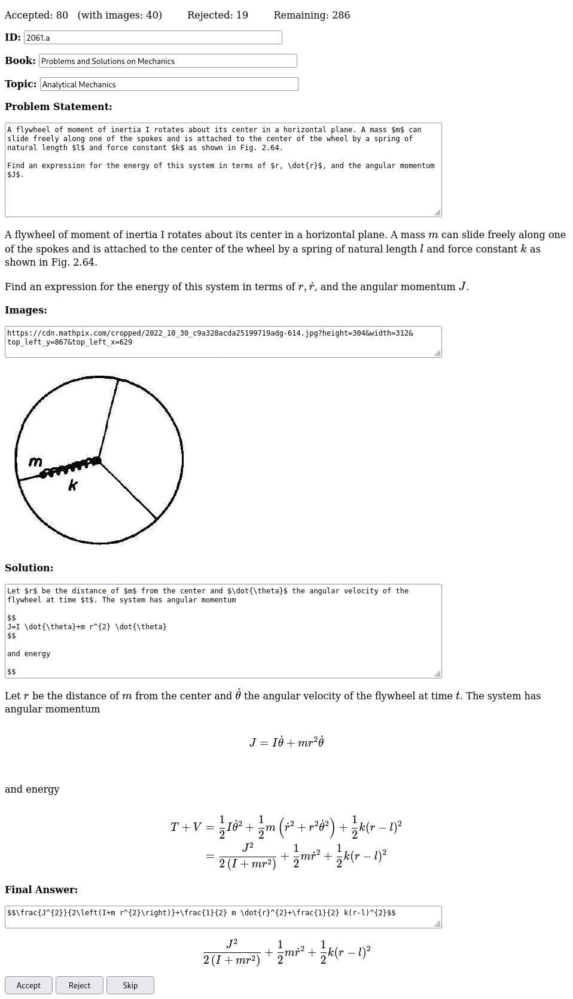

## Requirements
You need to install `flask`.
```bash
pip install flask
```

## Usage
The script accepts the following arguments:
- `--problems_file`: The path to the `.json` file that contains the problems, e.g. `physics_books/data/em_quals_output.json`.
- `--final_problems_file` (optional): The path to the `.json` file where the final problems will be saved. If not provided, filename will be `problems_file` with `_final` appended, e.g. `physics_books/data/em_quals_output_final.json`.
- `--rejected_problems_file` (optional): The path to the `.json` file where the rejected problems will be saved. If not provided, filename will be `problems_file` with `_rejected` appended, e.g. `physics_books/data/em_quals_output_rejected.json`.

To run the script, use the following command:
```bash
python app.py --problems_file FILE
```
You should see a message like
```bash
 * Running on http://127.0.0.1:5000
```
You can then open the link in your browser and should see something like this:


You can edit the problem statement/solution/final answer fields, and the display below should update accordingly.
A doc with instructions can be found on Discord.

When you're done, click the "Accept" button to save the problem. If the problem is not suitable (e.g. it's not a computational problem, see the instructions doc), click "Reject". If you're not sure for now, or you want to come back to it later, click "Skip".
After that the next problem will be loaded.

Final problems will be saved to `final_problems_file`, and rejected problems will be saved to `rejected_problems_file`, while the original `problems_file` will not be modified.

> **Note**
> 
> Your progress is saved every time you click "Accept" or "Reject", so you can stop the script at any time and resume later. Note that if you edit and skip a problem, your changes will be lost when you stop the script.
> 
> To resume, simply run the script again with the same arguments.

When you re-run the script, please close the old browser tab and open a new one.

## Notes
The script uses  to render LaTeX. While it supports most LaTeX commands, it doesn't support all of them. If you encounter a valid LaTeX formula that KaTeX doesn't render, you can edit it or probably just leave it as is.
> **Warning**
> 
> Right now, stuff like `\sqrt{x}` and `\sqrt[3]{x}` are not rendered correctly with KaTeX (the square root symbol is missing). I'm trying to figure out why, but in the meantime, just ignore it.